# ERCOT Load Forecasting
## Predicting Texas Grid Demand with Machine Learning

Jamie Moseley · EID jbm4577
Intro to Machine Learning · Prof. Varun Rai · Spring 2026
April 29, 2026

---

## Contents

1. Problem & motivation
2. Data & feature engineering
3. Baseline models: classification then regression
4. The underprediction problem
5. Expanded models: improved classifier & regression
6. Limitations and conclusions

---

## Problem & Motivation

- ERCOT manages ~90% of Texas electricity: 26 million customers, 680+ generators
- Grid operators must predict load **24 hours ahead** to schedule generation
  - Too little power = blackouts
  - Too much = waste/inefficiencies (the better option but still not ideal)
- **Winter Storm Uri (Feb 2021):** demand spiked to ~65 GW while supply collapsed, a canonical out-of-distribution failure
- The Texas power grid is fully isolated and imports no power, meaning it's easy to analyze without risk of interstate imports interfering with analysis.

**The ML task:** given weather forecasts, predict hourly system-wide load (MW) for the next 24 hours

---

## Dataset & Cleaning

| | |
|---|---|
| **Rows (n)** | 41,992 hourly observations |
| **Features (p)** | 27 engineered features |
| **n × p** | ~1.13 million |
| **Date range** | Jan 1, 2021 to Dec 31, 2025 |
| **Train / test split** | 2021-2024 train · 2025 test¹ |

**Sources:** ERCOT Native Load (hourly MW) + Open-Meteo ERA5 reanalysis for Austin, Dallas, Houston, San Antonio

**Cleaning steps:** Weather joined to load on hourly timestamp · DST gaps handled via datetime-join (not `shift()`) to avoid off-by-one errors · Lag features computed against a sorted index; 9 NaN rows at the 2024/2025 boundary dropped · Final QA: 41,992 rows, zero missing values

Max observed load: **85,464 MW**, within 44 MW of the all-time ERCOT record (Aug 2023)²

<!-- _footer: "¹ Temporal split used as random splitting would leak future information ² Max observed load 85,464 MW is an hourly average; the 85,508 MW all-time record is a 15-min interval peak, dataset uses 1-hour averages" -->

---

## Feature Engineering

| Group | Features |
|---|---|
| Weather | temp, apparent temp, humidity, dew point, wind, solar radiation (× 4 cities + avg) |
| Nonlinear weather | CDH, HDH, temp² |
| Time / calendar | hour_sin/cos, month_sin/cos, dow_sin/cos, is_weekend, is_holiday, season |
| Interactions | temp × hour_sin, CDH × hour_sin, temp × is_weekend |

**Key decisions:**
- CDH = max(temp - 65°F, 0): "activates" only when AC is needed, r = **0.82** vs r = 0.57 for raw temp
- Cyclic sin/cos encoding: month_cos achieves r = -0.38 vs raw month r = 0.14

---

## Feature Correlations

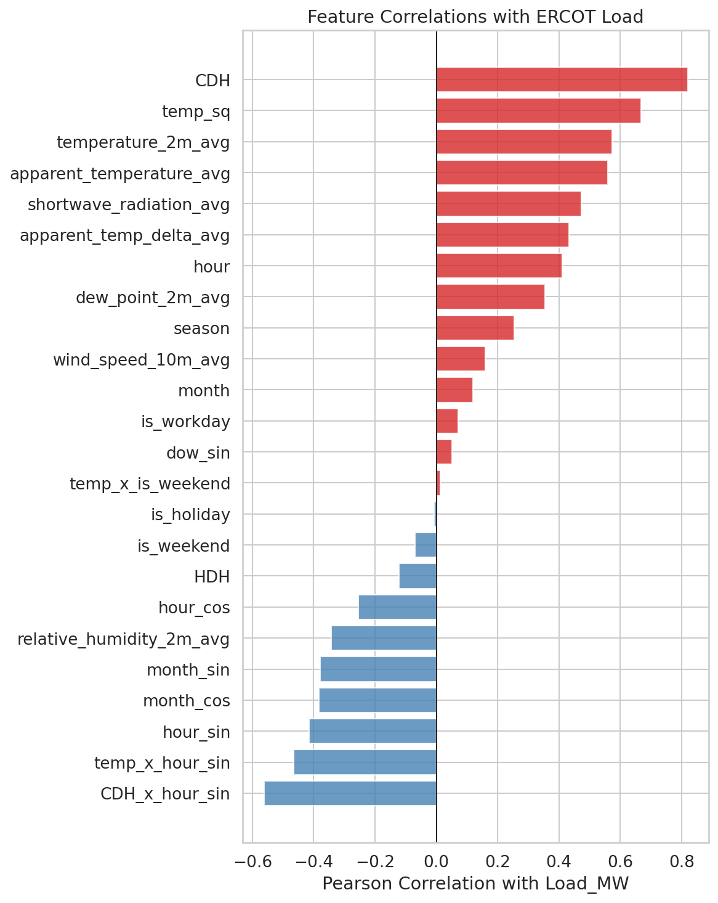

- **CDH dominates** (r = 0.82): far ahead of raw temperature (r = 0.57)
- **Cyclic encodings outperform raw integers**: month_cos (r = −0.38) vs month (r = 0.14)
- **Interaction terms add signal**: CDH × hour_sin and temp × hour_sin both rank in top 10
- apparent_temp and dew_point correlate highly but add little over CDH: they measure the same heat stress signal

---

## EDA: Key Findings

**1. The U-shape is real and stark**
Load minimum near 65°F; summer side is far steeper: Texas's AC-heavy profile

**2. The daily cycle has a surprising shoulder**
Peak load at hours 16–18, not at solar noon: thermal inertia delays demand by 3–4 hours

**3. Winter Storm Uri is clearly visible**
Sharp spike to ~65 GW in Feb 2021: nearly double typical winter load, and it's in our training data

---

## Temperature vs. Load (U-shape)

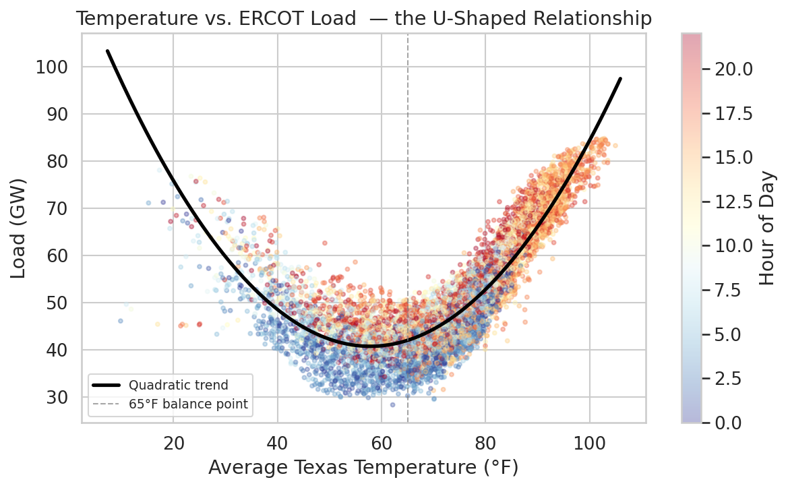

- Balance point near **65°F**: load is minimized when no heating or cooling is needed
- Load rises more steeply at high temperatures than at low: AC demand grows faster than heating demand
- The U-shape is why raw temperature is a weak predictor (r = 0.57) but CDH/HDH are strong (r = 0.82)
- Color shows hour of day: afternoon hours (red) drive the highest summer peaks

---

## Time Series: 2021–2025

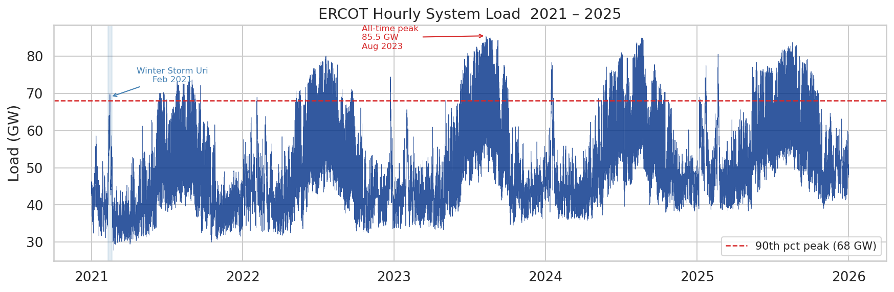

- **Seasonal pattern repeats** each year: summer peaks dominate, winter is secondary
- **Uri spike (Feb 2021)**: sharp winter demand surge, annotated on chart
- **Demand trend upward** over 2021–2025: data center and population growth lifting the baseline

---

## Model Setup

**Validation strategy**
- Train set: 2021–2024 (35,064 hours) · Test set: 2025 (8,760 hours)
- Temporal split: shuffling would allow future load values to appear in training
- Hyperparameter tuning via `TimeSeriesSplit(n_splits=5)`: folds respect time order

**8 regression models compared**
OLS · Ridge · Lasso · Decision Tree · Random Forest · Gradient Boosting · SVR · MLP

- Ridge/Lasso: regularization path searched over λ ∈ [10⁻³, 10⁶]
- Tree ensembles: depth and leaf size tuned via GridSearchCV
- SVR and MLP: features standardized with `StandardScaler` before fitting

**Classification task** (same features): binary `is_peak` label, defined as top 10% of hourly load

---

## Classification Results (Baseline)

**Task:** predict `is_peak` (top 10% of hourly load) · weather-only features · metrics at F1-optimal threshold

| Model | AUC | Threshold | Precision | Recall | F1 |
|---|---|---|---|---|---|
| Logistic Regression | 0.995 | 0.01 | 0.910 | 0.921 | 0.915 |
| Logistic + Ridge | 0.995 | 0.03 | 0.921 | 0.906 | 0.913 |
| **Logistic + Lasso** | **0.995** | **0.03** | **0.939** | **0.903** | **0.921** |
| Random Forest | 0.987 | 0.02 | 0.882 | 0.917 | 0.899 |
| Gradient Boosting | 0.987 | 0.01 | 0.909 | 0.892 | 0.900 |

- ~**91% precision, ~91% recall** at F1-optimal threshold: 9 in 10 peak hours flagged correctly
- Low optimal threshold (t=0.01–0.03) reflects class imbalance: only 10% of hours are peaks, compressing raw probabilities toward zero
- CDH and time-of-day features dominate (consistent with regression; see A10)

---

## ROC Curves

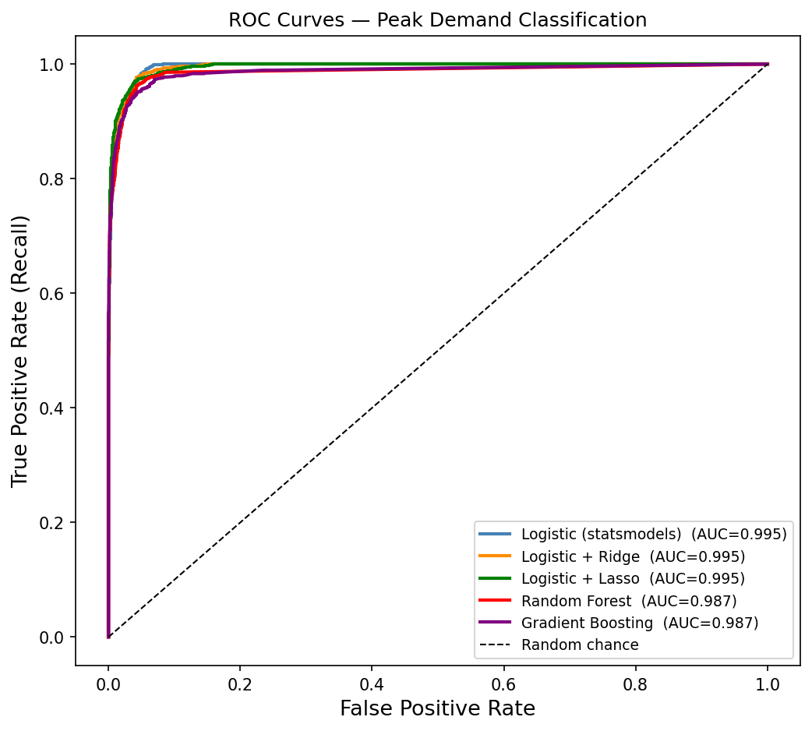

- All classifiers achieve **AUC ≥ 0.987**: peak hours are highly predictable from weather and time features alone
- Logistic models reach **AUC = 0.995**: the decision boundary is nearly linear in feature space
- At default threshold (t=0.5): precision=1.0 but only 40–53% of peaks caught — too conservative for operations
- Optimal threshold (t≈0.01–0.03): ~91% precision and ~91% recall — 9 in 10 peaks flagged (see Appendix A15)

---

## Regression Results (Baseline)

8 models trained on 2021–2024, tested on 2025

| Model | RMSE (MW) | R² | MAPE |
|---|---|---|---|
| SVR (RBF kernel) | 6,461 | 0.60 | 11.2% |
| Gradient Boosting | 6,558 | 0.59 | 11.5% |
| Random Forest | 6,584 | 0.59 | 11.4% |
| OLS Linear | 6,699 | 0.57 | 11.4% |
| Ridge | 6,703 | 0.57 | 11.3% |
| MLP | 6,732 | 0.57 | 11.6% |
| Lasso | 6,734 | 0.57 | 11.4% |
| Decision Tree | 6,881 | 0.55 | 11.5% |

All 8 models fall within a ~420 MW band: feature engineering dominated model selection

---

## Model Comparison

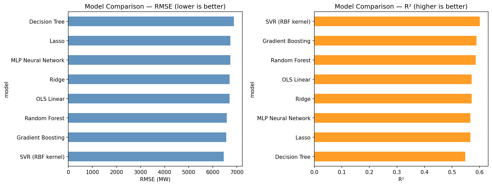

- All 8 models within a **~420 MW RMSE band**: less than 7% difference from best to worst
- SVR leads on both RMSE and R², with identical ranking across both metrics
- **Takeaway:** SVR wins, but a 420 MW margin across 8 algorithms shows feature engineering matters more than model choice

---

## The Underprediction Problem

All baseline models systematically underpredict by ~5–8 GW on 2025 data

**Root cause:** Texas demand has grown rapidly since 2021 due to data center construction and population growth, a case of **distribution shift**, not a model bug

**Five approaches to fix it:**

| Approach | Mechanism |
|---|---|
| Bias correction | Mean residual on 2024 calibration data; add as scalar offset |
| Lag features | load_lag_24h + load_lag_168h: yesterday's actual anchors the model to current demand level |
| Days-elapsed trend | Continuous time counter (days since Jan 1, 2021): model learns and extrapolates demand growth |
| Lag + trend | Combines both: anchors current level AND extrapolates the growth curve |
| Annual retrain | Extend training from 2021–2024 to 2021–2025; 2026 becomes the new test set; adds one year of high-demand data, but alone does not close the gap |

These mechanisms are combined orthogonally — retrain × {no extra, lag, trend, both} — yielding **8 evaluated variants** total (plus bias correction as a post-hoc scalar offset).

---

## Underprediction Gap

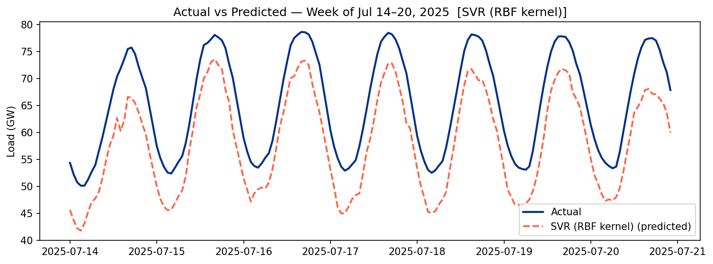

- Predicted curve (dashed) **tracks the shape** correctly: daily cycles and peaks align
- But the entire curve sits **~5–8 GW below** actual: a systematic offset, not noise
- The model correctly predicts *when* demand peaks, but underestimates *how high* those peaks are

---

## Classification: Feature Impact

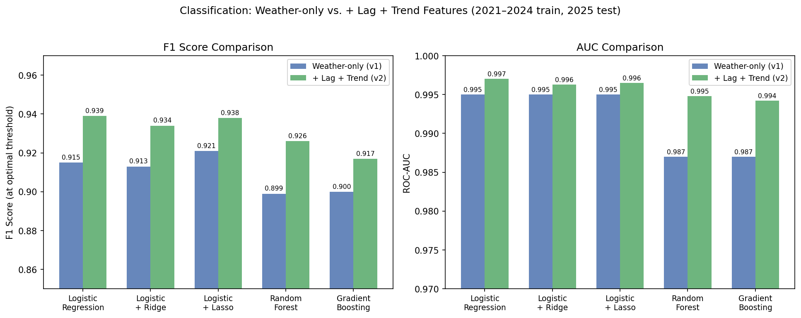

Same 2021–2024 train / 2025 test split as the baseline — improvement is purely from adding `load_lag_24h` and `days_elapsed`. Training on 2021–2025 was skipped here: the 2026 holdout covers only Jan–Apr, excluding summer peaks and making the test label distribution unrepresentative.

---

## Best Approach: 2025 Retrain + Lag + Trend

Two features address distribution shift from different angles:

- `load_lag_24h` anchors the absolute demand level: today's load ≈ yesterday's, adjusted for conditions
- `days_elapsed = (timestamp − 2021-01-01) / 86400` lets models learn and extrapolate the growth slope
- OLS trend coefficient (trend-only model): **+5.78 MW/day (+2.1 GW/year)**, consistent with ERCOT's reported data center growth

**Offline test results (Jan–Apr 2026 holdout, 2,831 hours):**

| Model | RMSE | R² |
|---|---|---|
| SVR | 1,378 MW | 0.952 |
| Gradient Boosting | 1,447 MW | 0.947 |
| MLP | 1,475 MW | 0.945 |
| OLS | 1,934 MW | 0.906 |

**83% RMSE reduction** vs. weather-only baseline (7,895 MW → 1,378 MW)

---

## 2026 Holdout RMSE by Approach

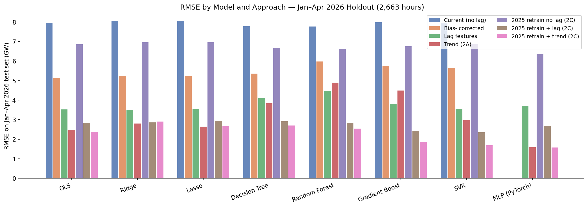

---

## Live Evaluation

8 approaches evaluated on April 29, 2026 actual ERCOT load (17 hours)

| Approach | Best model | Live RMSE |
|---|---|---|
| Current (weather-only) | Ridge | 7.44 GW |
| Bias-corrected | Ridge | 4.42 GW |
| 2025 retrain | Gradient Boost | 5.23 GW |
| Lag features | Lasso | 1.36 GW |
| Days-elapsed trend | Ridge | 1.11 GW |
| **2025 retrain + lag** | **Gradient Boost** | **0.94 GW** |
| **2025 retrain + trend** | **SVR** | **0.71 GW** |
| **2025 retrain + lag + trend** | **SVR** | **0.51 GW** |

Retraining alone doesn't help (5.23 GW). The improvement comes from combining more data with features that encode demand level and growth trend.

---

## Limitations & Future Work

| Limitation | Detail |
|---|---|
| No real-time lag | lag_24h requires yesterday's actual load: unavailable for true day-ahead forecasting without a live feed |
| Decision tree degradation | On mild spring days (CDH=0), DT collapses to 13 distinct predictions |
| Out-of-distribution events | Uri-style demand spike + supply collapse cannot be learned from normal training data |
| Trend extrapolation risk | days_elapsed assumes linear growth; a recession or efficiency shift would break this |

**Future improvements:**
- Rolling retrain monthly as new ERCOT data arrives
- Automate a rolling lag feed via ERCOT API so lag features stay current without manual runs
- Probabilistic forecasting: predict a confidence interval, not just a point estimate (e.g., quantile regression or conformal prediction)

---

## Conclusions

**1. Feature engineering > model selection for structured tabular data**
SVR led on both metrics, but all 8 models fell within ~420 MW of each other once temperature nonlinearity (CDH, temp²) and cyclic time features were engineered

**2. Distribution shift is the dominant error source**
The ~7 GW systematic underprediction was not a modeling failure: it was demand growth beyond training data levels

**3. The practical fix: lag anchoring + days-elapsed trend + annual retraining**
Combining lag features and a continuous time counter reduced RMSE by **83%** on the 2026 holdout (7,895 → 1,378 MW)
OLS trend coefficient (+2.1 GW/year) is directly interpretable and matches ERCOT's reported load growth from data center expansion

---

## Recommendations for Production Use

1. **Day-ahead operational forecasting:** deploy SVR with 2025 retrain + lag + trend; refresh lag inputs hourly via ERCOT API
2. **Long-horizon planning (>1 week):** use OLS trend-only model — coefficient (+5.78 MW/day) is interpretable and auditable by grid operators
3. **Re-evaluate quarterly:** distribution shift recurs as data center buildout continues; budget ~30 min/month for retraining as new ERCOT data arrives

---

## References

- ERCOT, Hourly Native Load Data: <https://www.ercot.com/gridinfo/load/load_hist>
- ERCOT, NP6-345-CD Actual System Load by Weather Zone API: <https://api.ercot.com>
- Open-Meteo, Historical Forecast API (ERA5 reanalysis): <https://open-meteo.com>
- James, Witten, Hastie & Tibshirani, *An Introduction to Statistical Learning*, 2nd ed. (2021)
- ERCOT, "Long-Term Load Forecast" (2025): context for data center growth projections

---

## AI Usage Disclosure

*Required per course policy*

This project used **Claude (Anthropic)** as a coding assistant throughout development. Specific uses included:

- Writing and debugging Python scripts for data acquisition, feature engineering, model training, and figure generation
- Troubleshooting API authentication (ERCOT OAuth2) and data pipeline issues
- Discussing analytical decisions (feature selection rationale, lag vs. trend approach)
- Drafting this report outline and slide deck

All model design decisions, analytical interpretations, and conclusions are the student's own.
The AI did not have access to the grading rubric and was used as a tool, not a decision-maker.

---

<!-- _class: lead -->

# Appendix

---

## A1: Full Time Series 2021–2025

---

## A2: Winter Storm Uri (Feb 2021)

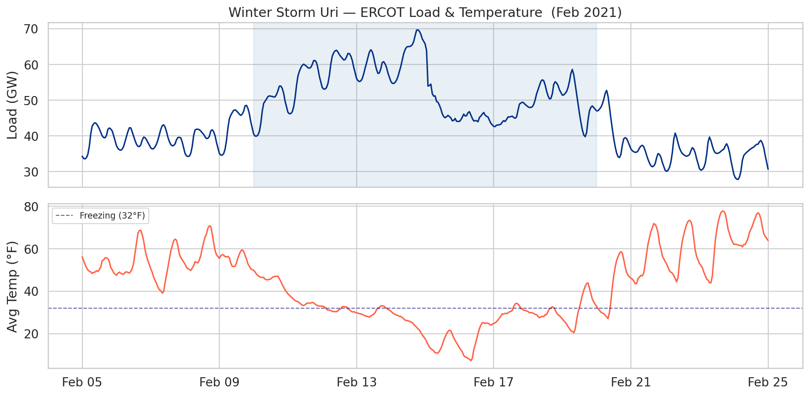

---

## A3: Hourly Load Profile

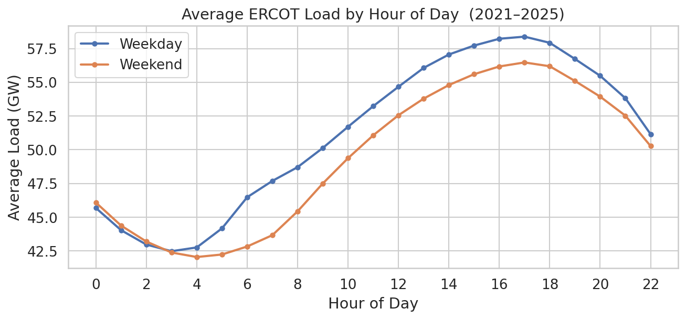

---

## A4: Monthly Load Profile

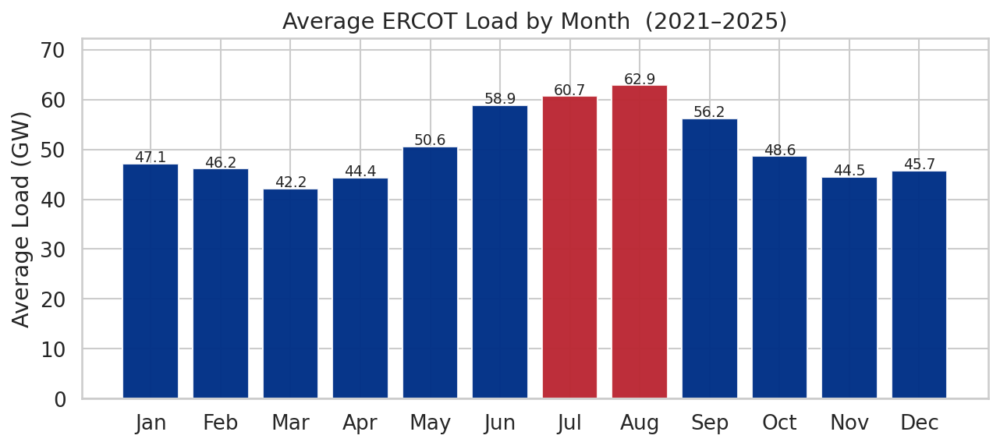

---

## A5: Correlation Heatmap

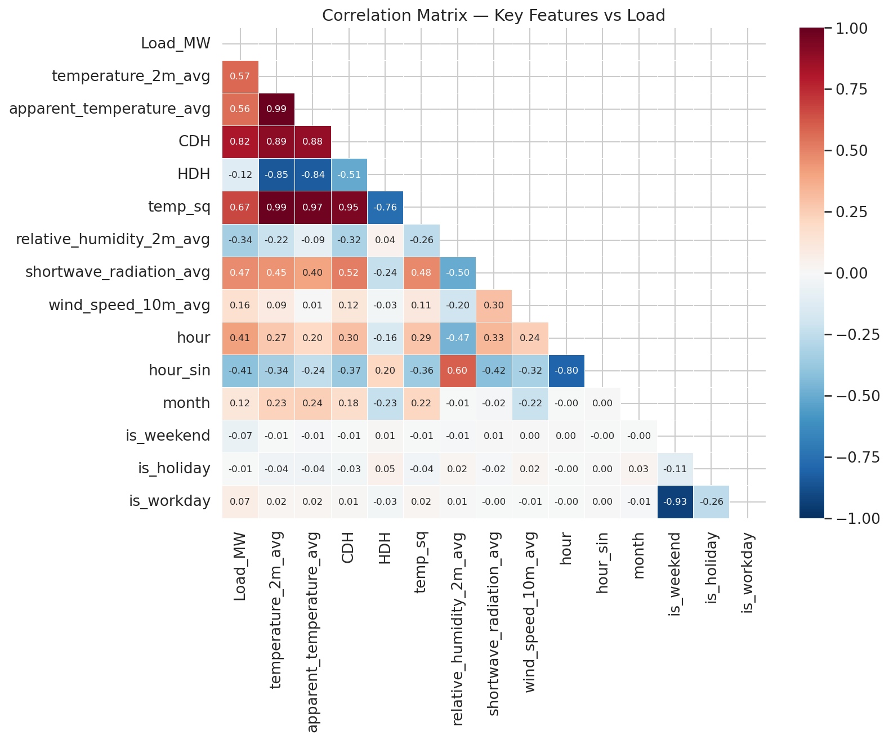

---

## A6: Load Distribution

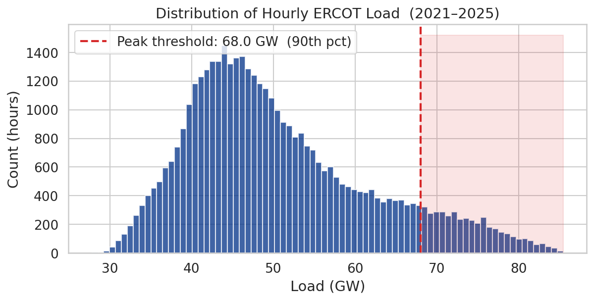

---

## A7: Season Boxplots

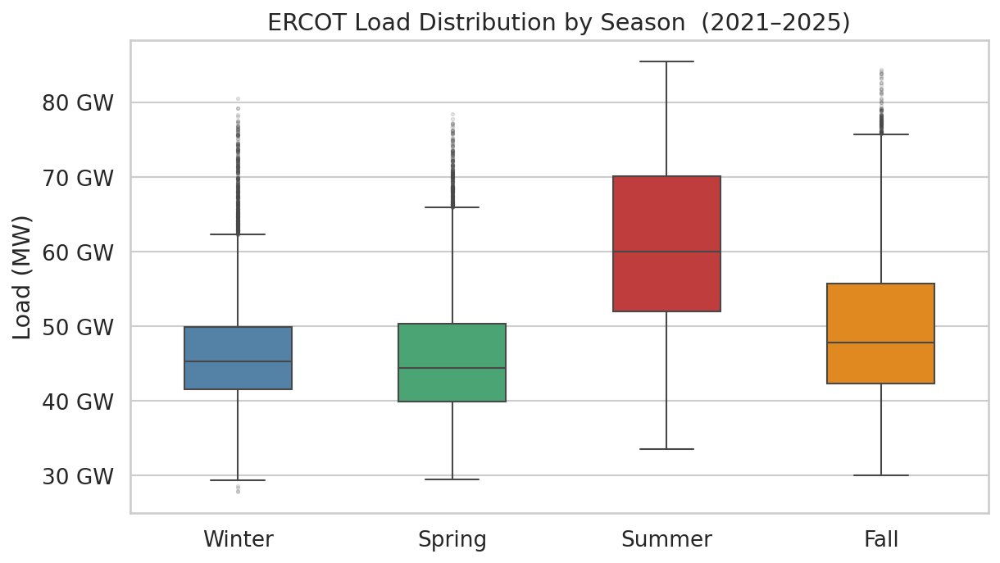

---

## A8: Ridge Regularization Path

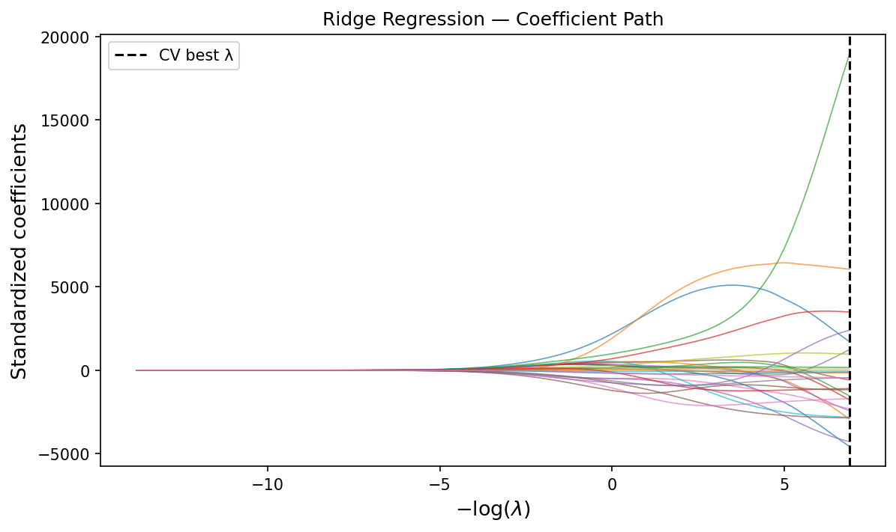

---

## A9: Lasso Cross-Validation

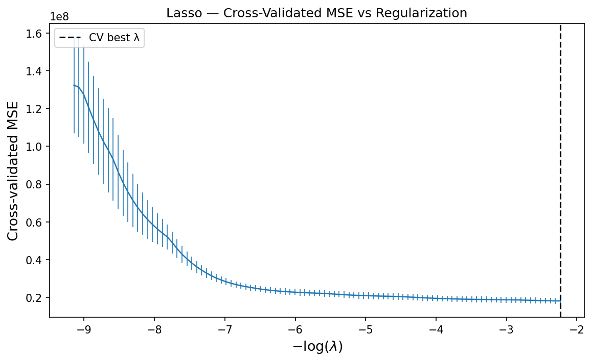

---

## A10: Random Forest Feature Importances

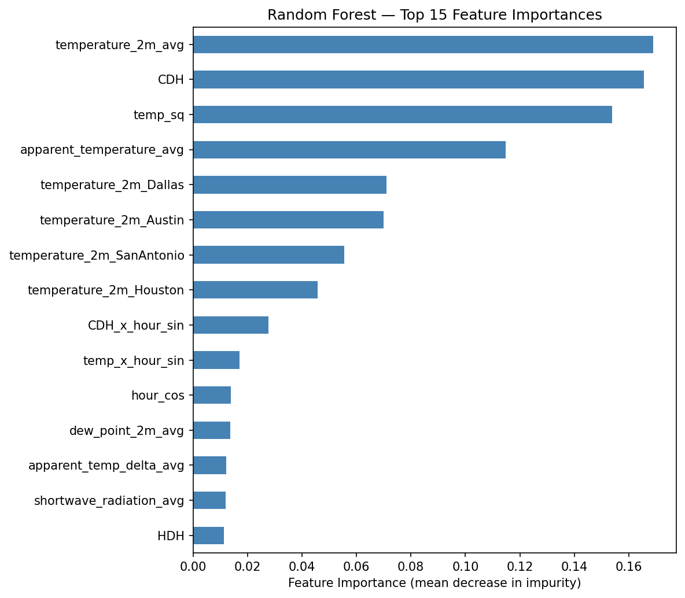

---

## A11: GBR Learning Curve

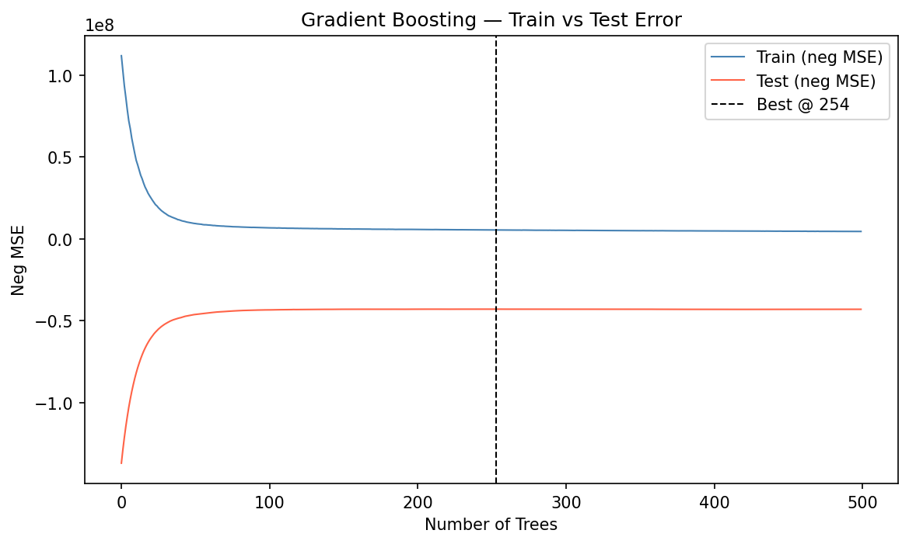

---

## A12: Residual Plots

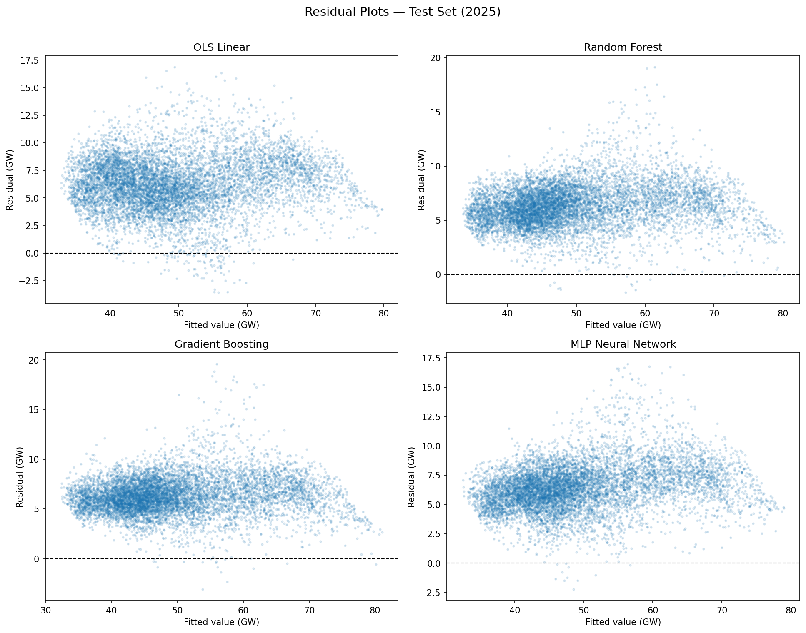

---

## A13: Precision-Recall Curves

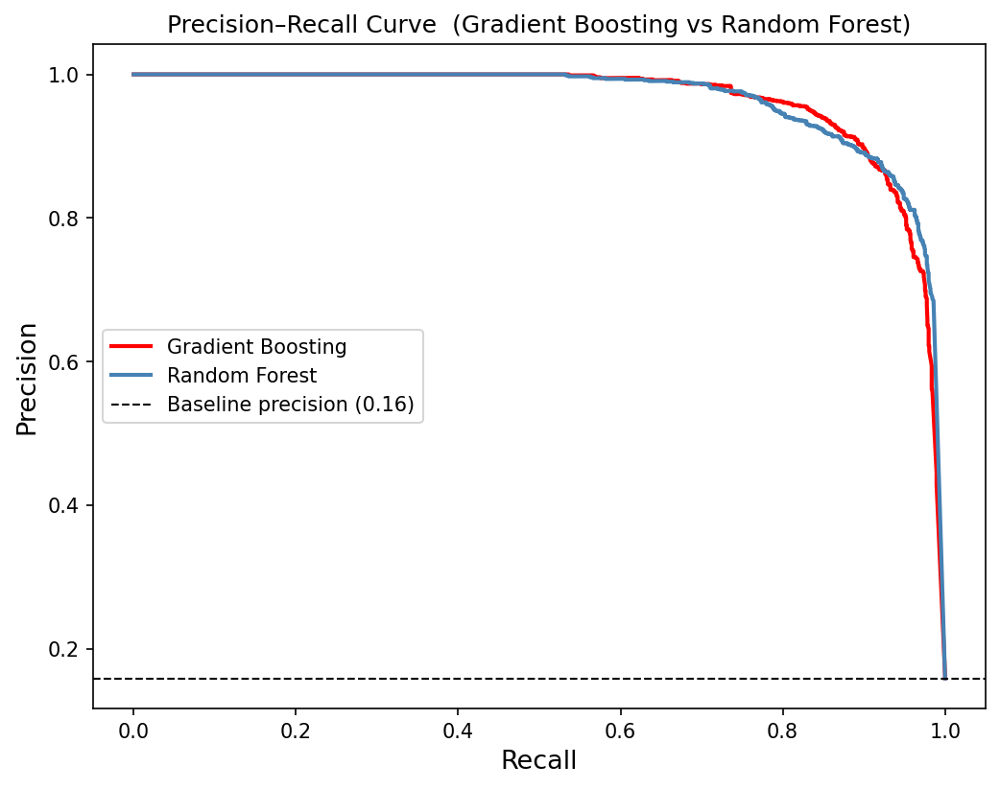

---

## A13b: Classification Feature Comparison (v1 vs v2)

---

## A14: Confusion Matrices (F1-Optimal Threshold, v2)

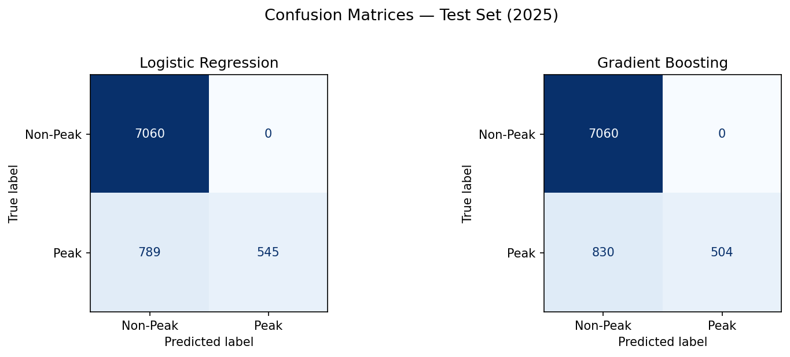

---

## A15: Threshold Sensitivity — All Classifiers

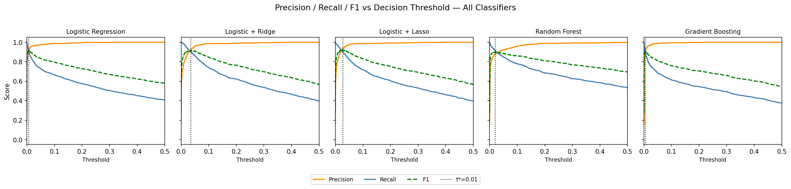

---

## A16: Approach Comparison (Live)

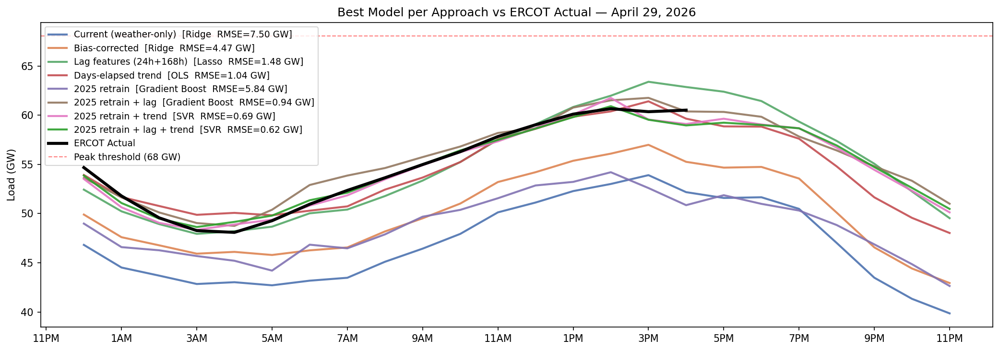

---

## A17: Live RMSE by Approach

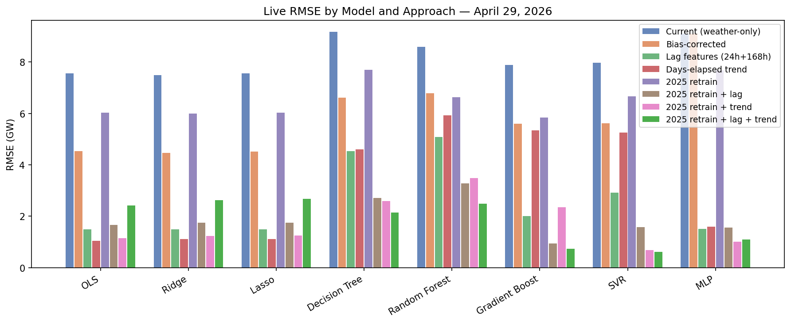

---

## A18: All Models by Approach

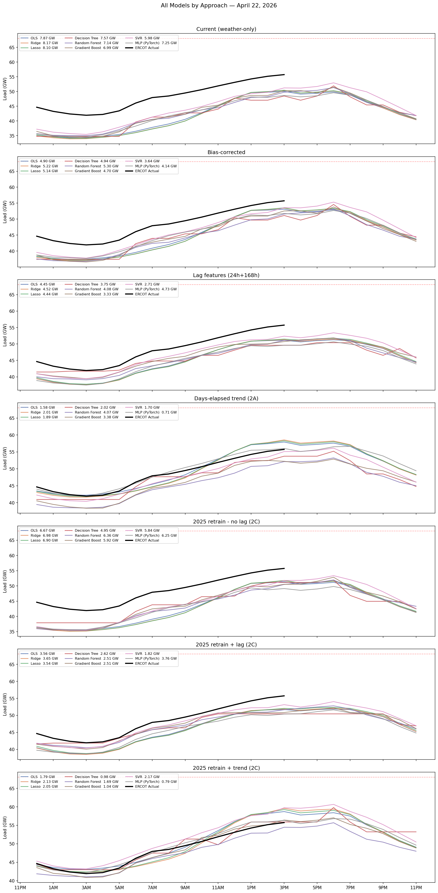

---

## A19: Hyperparameters

| Model | Key settings |
|---|---|
| Ridge | ElasticNetCV, λ grid 10⁶–10⁻³ (100 vals), best λ ≈ 0.001 |
| Lasso | ElasticNetCV, CV-selected λ, zeroed 4/27 features |
| Decision Tree | GridSearchCV: max_depth ∈ {3,5,8,12,None}, min_samples_leaf ∈ {10,50,100} |
| Random Forest | 300 trees, max_features='sqrt', min_samples_leaf=5 |
| Gradient Boosting | 500 estimators, lr=0.05, max_depth=5, subsample=0.8 |
| SVR | RBF, C=1e4, ε=500, gamma='scale' |
| MLP | [256→ReLU→DO(0.3)]→[128→ReLU→DO(0.2)]→[64→ReLU→DO(0.1)]→1, Adam lr=1e-3, 200 epochs |

Cross-validation: `TimeSeriesSplit(n_splits=5)`, no shuffling, preserves temporal order

---

## A20: Data Pipeline Notes

- **ERCOT 2021–2025:** downloaded from ercot.com native load history (annual CSVs)
- **ERCOT 2026:** fetched via OAuth2 API (NP6-345-CD), paginated, 2,831 rows (Jan 1 – Apr 28, 2026)
- **Weather:** Open-Meteo historical-forecast-api (ERA5 reanalysis), same endpoint used for live forecast on presentation day, guaranteeing identical feature schema
- **DST handling:** datetime-join (not shift()) for lag features; 1,830 DST gaps across full dataset
- **Final dataset after QA:** 41,992 rows, no missing values
